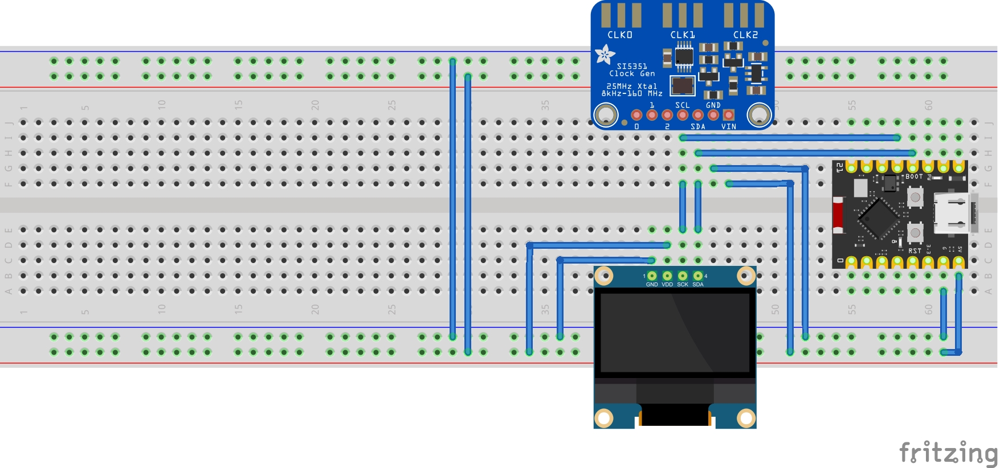

# Modo de Utilização do Beacon

## Material necessário

1. Microcontrolador ESP32C3 Super Mini
2. Display OLED 128 x 32 pixels SSD1306
3. Módulo gerador de clock si5351 (Caso queira desenvolver a parte de RF)
   
Substitua o LED na saída no pino 5 por um acoplador ótico que funcionará como chave de telegrafia podendo ser utilizado em qualquer radio que possua uma entrada para chave de cw. Nesse caso pode-se retirar do código todas as referências ao si5351 pois o rádio é que fará o papel de transmissor.
## Esquema de ligação

## Passo a Passo

1. **Transferência do Programa**  
   Após transferir o programa ao microcontrolador, no primeiro uso ele não terá mensagens gravadas.

2. **Configuração da Rede Wi-Fi**  
   Certifique-se de que há um celular compartilhando a rede Wi-Fi com os seguintes valores (definidos no software):  
   - **SSID:** `BEACON`  
   - **Senha:** `12345678`

3. **Conexão e Obtenção do IP**  
   Quando conectado, o dispositivo exibirá no display o **IP** atribuído. 

4. **Envio de Mensagem**  
   Utilize qualquer programa que envie mensagens via **UDP**:  
   - Configure o **IP** exibido pelo dispositivo.  
   - Use a **porta padrão**: `55000` (que pode ser modificada no software, se necessário).

5. **Início da Transmissão**  
   Após o dispositivo receber a mensagem:  
   - O módulo Wi-Fi será desligado.  
   - O display será desativado.  
   - A transmissão da mensagem será iniciada.

## Contato

Caso haja qualquer dúvida ou se fizer uma montagem utilizando esse projeto, peço que mande um feedback para o seguinte email: py4rdg@gmail.com 
