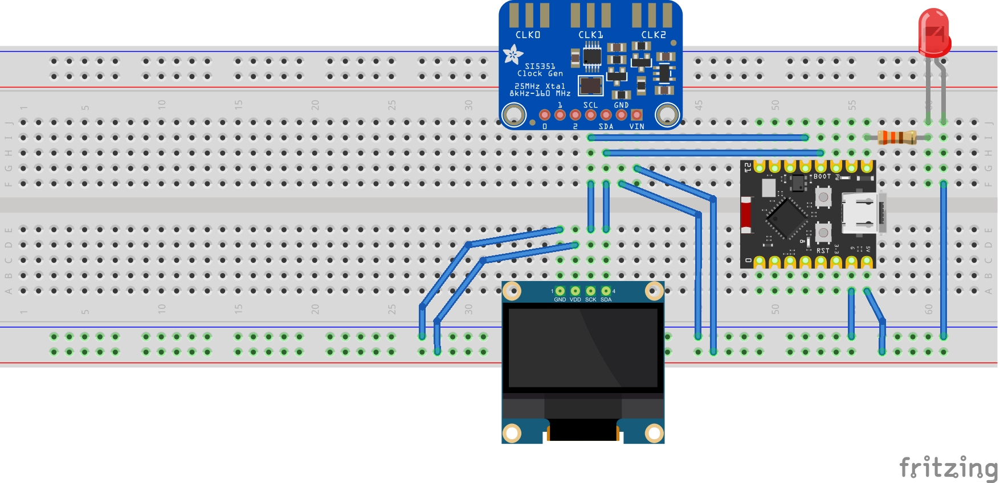

# Modo de Utilização do Beacon

## Material necessário

1. Microcontrolador ESP32C3 Super Mini
2. Display OLED 128 x 32 pixels SSD1306 (Caso seja usado um maior deve-se modificar o código para o novo tamanho)
   ```cpp
   #define SCREEN_WIDTH 128  // Largura do display (em pixels)
   #define SCREEN_HEIGHT 32  // Altura do display (em pixels)
   ```
3. Módulo gerador de clock si5351 (Caso queira desenvolver a parte de RF)
   
Substitua o LED na saída no pino 5 (Verifique no seu microcontrolador que a contagem dos pinos é diferente dos circuitos integrados comuns. Quando digo pino 5 é o pino GPIO 5) por um acoplador ótico que funcionará como chave de telegrafia podendo ser utilizado em qualquer radio que possua uma entrada para chave de cw. Nesse caso pode-se retirar do código todas as referências ao si5351 pois o rádio é que fará o papel de transmissor. Veja a pinagem do ESP32C3 Super Mini:


## Esquema de ligação


## Passo a Passo

1. **Transferência do Programa**  
   Após transferir o programa ao microcontrolador, no primeiro uso ele não terá mensagens gravadas.

2. **Configuração da Rede Wi-Fi**  
   Certifique-se de que há um celular compartilhando a rede Wi-Fi com os seguintes valores (definidos no software):  
   - **SSID:** `BEACON`  
   - **Senha:** `12345678`

3. **Conexão e Obtenção do IP**  
   Quando conectado, o dispositivo exibirá no display o **IP** atribuído. 

4. **Envio de Mensagem**  
   Utilize qualquer programa que envie mensagens via **UDP**:  
   - Configure o **IP** exibido pelo dispositivo.  
   - Use a **porta padrão**: `55000` (que pode ser modificada no software, se necessário).
   - A mensagem deve conter apenar letras (**MAIÚSCULAS**), números, espaços e o caractere /.
   - A velocidade de transmissão deve ser ajustada mudando-se o valor da constante PONTO que está em 150 milisegundos. Diminuindo o valor aumenta-se a velocidade de transmissão e vice-versa. Altere a linha para o novo valor.
       ```cpp
        #define PONTO 150
        ```

5. **Início da Transmissão**  
   Após o dispositivo receber a mensagem:  
   - O módulo Wi-Fi será desligado.  
   - O display será desativado.  
   - A transmissão da mensagem será iniciada.

## Contato

Caso haja qualquer dúvida ou se fizer uma montagem utilizando esse projeto, peço que mande um feedback para o seguinte email: py4rdg@gmail.com 

# Beacon Usage Guide

## Required Materials

1. **ESP32C3 Super Mini Microcontroller**  
2. **128 x 32 pixels OLED Display SSD1306**  
   - If using a larger display, modify the code to match the new dimensions:
     ```cpp
     #define SCREEN_WIDTH 128  // Display width (in pixels)
     #define SCREEN_HEIGHT 32  // Display height (in pixels)
     ```
3. **Si5351 Clock Generator Module**  
   - Required if you plan to develop the RF section.

Replace the LED on the *pin 5 output with an **optical coupler**. This will function as a telegraph key, compatible with any radio featuring a CW key input. In this case, all references to the Si5351 can be removed from the code, as the radio will act as the transmitter. Refer to the ESP32C3 Super Mini pinout below:

*note that the pin numbering on your microcontroller may differ from common integrated circuits. Here, pin 5 refers to GPIO 5


---

## Connection Diagram


---

## Step-by-Step Instructions

### 1. Program Upload
After uploading the program to the microcontroller, no messages will be stored initially.

### 2. Wi-Fi Network Configuration
Ensure a mobile device is sharing a Wi-Fi network with the following credentials (defined in the software):
- **SSID:** `BEACON`  
- **Password:** `12345678`

### 3. Connection and IP Retrieval
Once connected, the device will display the assigned **IP** on the screen.

### 4. Message Transmission
Use any program capable of sending messages via **UDP**:
- Configure the displayed **IP** on the device.
- Use the **default port**: `55000` (modifiable in the software if necessary).
- The message must contain **only uppercase letters**, numbers, spaces, and the `/` character.
- Adjust the transmission speed by modifying the value of the `PONTO` constant (initially set to 150 milliseconds). Lower values increase the speed, and higher values decrease it:
  ```cpp
  #define PONTO 150
  ```
### 5. Transmission Start
After the device receives the message:
- The Wi-Fi module will turn off.
- The display will deactivate.
- The message transmission will begin.

### 6. Contact
If you have any questions or build a setup using this project, please send feedback to the following email:
py4rdg@gmail.com
